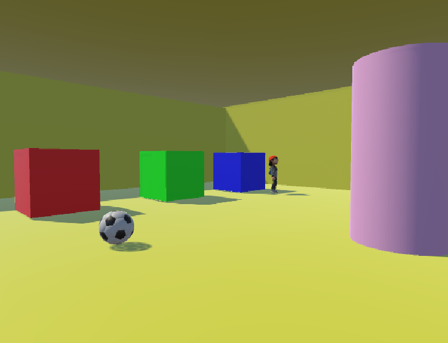
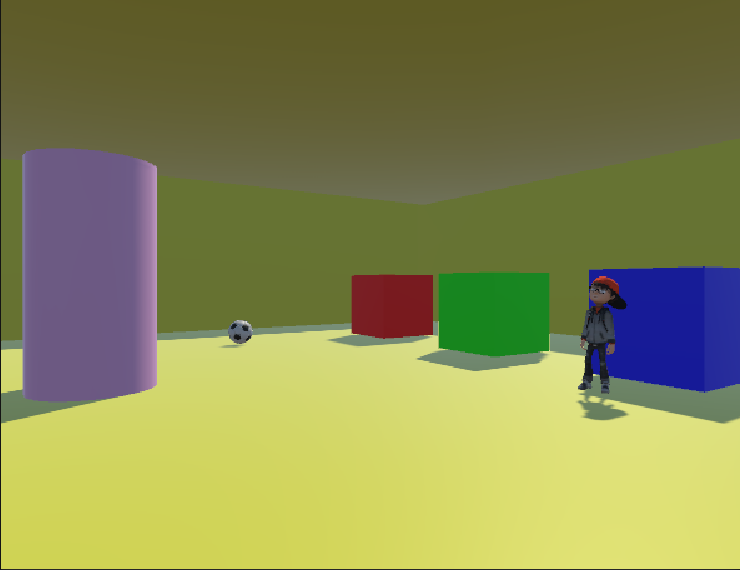

# Study in Russia Portfolio

## About Me
MSc in Computer Science | VR & AI Enthusiast  
Focus: Human-Computer Interaction, Computer Vision, VR Education

## CV
Preview

## Projects

### Kinect Hand Detection
- Real-time hand detection with Microsoft Kinect v1  
- Left/right hands visualized with colored circles (blue = left, red = right)  
- GitHub: [Link](https://github.com/mounamin/kinect-hand-detection)

### VR Classroom Prototype
- Unity 3D VR classroom environment  
- Supports headset movement and object interaction  
- GitHub: [Link](https://github.com/mounamin/vr-classroom-prototype)

## Screenshots
| Kinect Hand Detection | VR Classroom Prototype |
|----------------------|----------------------|
|  |  |
|  |  |

